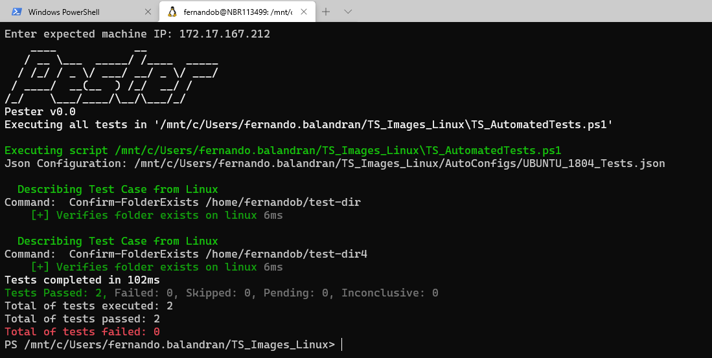

# ReadyServer

Testing Framework for Servers Images (Windows and Linux Supported)

This testing framework is designed to be fully configurable through json files, and powershell scripts. It is built around two modules Pester, and Winster. [Pester](https://github.com/pester/Pester) is a unit testing framework that gives us nice functionality out of the box for [unit testing](https://en.wikipedia.org/wiki/Unit_testing).

[Winster](https://github.com/TheFern2/Winster) is a module built around items that need to be tested on Windows OS, which can be then used through json configuration.

> Footnote: Linux compatibility was added later on, as powershell is now supported on some linux distros. A new module like Winster will have to be created for testing Linux specific items.

## What is ReadyServer exactly for?

In the beginning this unit testing framework was created to test Windows Virtual Machines in servers with 30-40 VMs. In order to do Quality Assurance before sending to production. At a much later stage, Linux support was added in order to use the same framework to test Linux VMs under the same server. At early stages of I had to perform Windows Machines quality assurance all manually which took a big effort when you are testing dozens of VMs.

ReadyServer is a unit testing framework especifically built for servers, but it can run on any Windows and Linux machine as long powershell is installed.

## How to setup the framework?

In order to run the framework, you need to setup a few files:

- CFG_Hosts.csv if you want to check the Windows hosts file.
- CFG_MachinesList.csv needs to know machines information, the columns are just examples.
- Configure JSON files which contain unit tests.
- If Winster doesn't do what you need, write a custom module for your specific test cases.
- Run TS_Main.ps1 and watch the magic happen.

## Documentation Table of Contents

- [Getting Started](./Docs/Getting-Started.md)
- [Usage](./Docs/Usage.md)
- [Json Files](./Docs/Json-Files.md)
- [Test Case](./Docs/Test-Case.md)
- [Background](./Docs/Background.md)

## Screenshots

### Windows Powershell

###

## Framework High Level Overview

