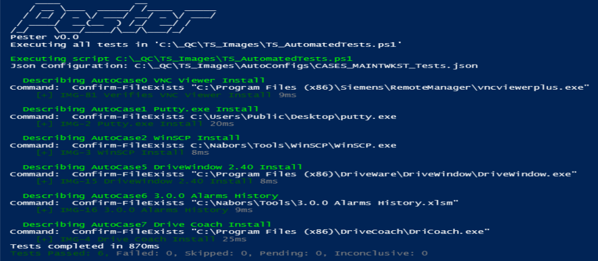
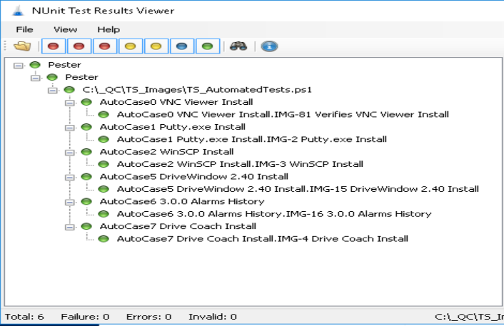
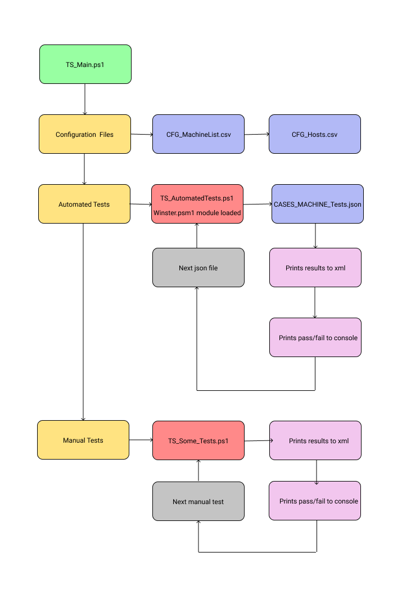

# ServerLab
Testing Framework for Servers

This testing framework is designed to be fully configurable through json files, and powershell scripts. It is built around two modules Pester, and Winster. [Pester](https://github.com/pester/Pester) is a unit testing framework that gives us nice functionality out of the box for [unit testing](https://en.wikipedia.org/wiki/Unit_testing).

[Winster](https://github.com/kodaman2/Winster) is a module built around items that need to be tested on Windows OS, which can be then used through json configuration.

## Documentation Table of Contents

- [Getting Started](./Docs/Getting-Started.md)
- [Usage](./Docs/Usage.md)
- [Json Files](./Docs/Json-Files.md)
- [Test Case](./Docs/Test-Case.md)
- [Background](./Docs/Background.md)

## Screenshots

## Framework High Level Overview

